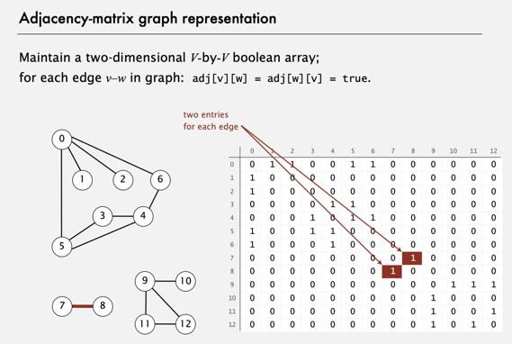
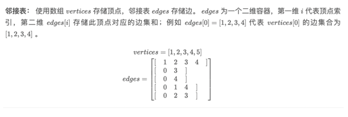

# Graph

## 定义

### Vertex

### Edge

### 度、入度、出度

## 按图的边分类

### 无向图

### 有向图

### 加权无向图

### 加权有向图

## 按图的密度分类

        如果一幅图中不同的边的数量在定点总数V的一个小的常数倍以内，那我们就认为该图是稀疏图，否则是稠密图

### 稀疏图

+ 顶点多
+ 边少

### 稠密图
+ 边多
+ 顶点少

## 图的实现

### 邻接矩阵

        即有N个顶点的图，用 N * N 的二维数组表示，

- 优点
  更适合存储稠密图
- 缺点；
  无法表示平行边
  无法表示超大图

### 边的数组

* 顶点存储和邻接表

* 邻接矩阵
*

### 邻接表

- 优点
  更适合存储稀疏图

## 图搜索

- Deep First Search
+ 前序遍历
+ 中序遍历
+ 后序遍历

- Width Fist  Search
+ 层序遍历