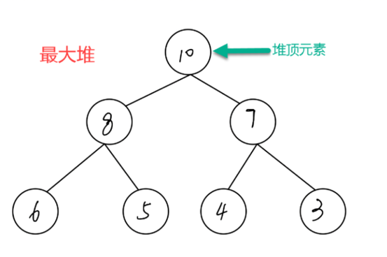
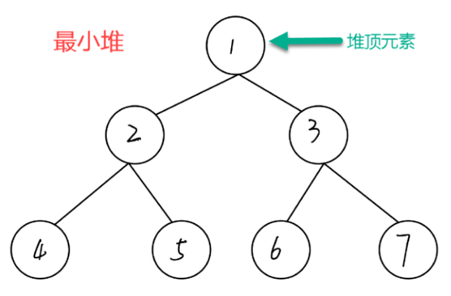

#  Heap

## Define

    即堆是满足一定条件得二叉树，
        
    父节点的值一定不大于或不小于子节点的值。堆被认为在计算机算法中起到重要作用，并被用于各种编程语言
            
    二叉堆是一组能够用堆有序的完全二叉树排序的元素，并在数组中按照层级存储（不使用数组的第一个位置）

## 特点
1. 可以在O(logN)的时间复杂度内插入元素
2. 可以在O(logN)的时间复杂度内删除元素
3. 可以在O(1)的时间复杂度内获取最大值或最小值

## 分类

+ 最大堆
    - 每一个节点的值大于等于其孩子节点的值.故最大堆的根节点值最大

+ 最小堆
    - 每一个节点的值小于等于其孩子节点的值.故最小堆的根节点值最小

## Using

    是实现优先队列得首选数据结构