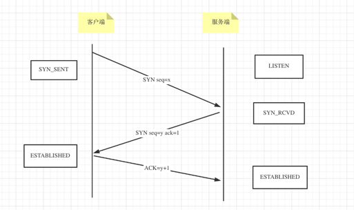
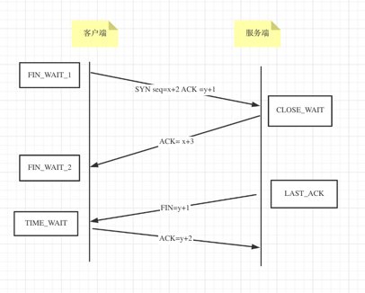
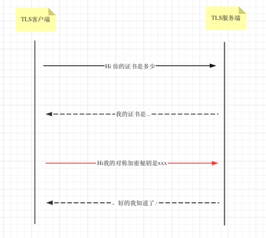
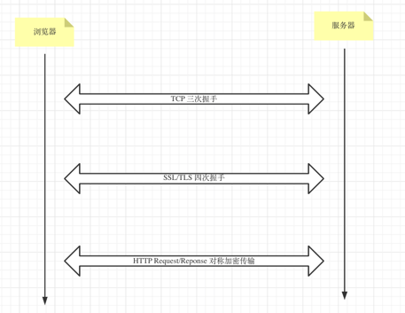

# TCP/IP

## TCP

### 三次握手

+ 客户端状态
   
    CLOSED-> SYN-SENT->ESTABLISHED
    
+ 服务端状态

  CLOSED->LISTEN -> SYN_RCVD ->ESTABLISHED

+ 核心是两将军问题 
    三次握手恰好保证了自己和对方的发送接收都没有问题

### 四次挥手

+ 客户端
  
    ESTABLISHED->FIN_WAIT_1->FIN_WAIT_2->TIME_WAIT->CLOSED
  
+ 服务端
    
   ESTABLISHED->CLOSE_WAIT->LAST_ACK->CLOSED

+ 核心问题
     
 TCP链接是全双工的,四次挥手分两次为一组分别关闭两个工链接

    

### 黏包/拆包

### 流控

## UDP

## SSL/TLS协议

### Secure Socket Layer 安全套接层

### Transport Layer Security 传输层安全协议

## HTTPS

